# IMDb Movie Analysis 🎬🍿

[](https://www.python.org/) [](https://jupyter.org/) [](LICENSE)

**IMDb Movie Analysis** is an exploratory data analysis (EDA) project that delves into movie data sourced from IMDb. The analysis is conducted using a Jupyter Notebook and a CSV dataset containing movie details. This project aims to uncover insights into movie trends, ratings, genres, and other key features that influence box office success and audience reception.

---

## 📖 Table of Contents

- [Overview](#overview)
- [Dataset Description](#dataset-description)
- [Key Objectives](#key-objectives)
- [Flow Diagram](#flow-diagram)
- [Project Structure](#project-structure)
- [Installation & Setup](#installation--setup)
- [Usage](#usage)
- [Call-to-Action](#call-to-action)
- [License](#license)
- [Acknowledgements](#acknowledgements)

---

## 🔍 Overview

In this project, we perform an in-depth exploratory data analysis on a dataset of movies. Using Python and Jupyter Notebook, we clean, visualize, and analyze the data to reveal trends and patterns that are relevant to the film industry. The insights generated from this analysis can be used to understand what makes a movie successful and how different factors—such as genre, runtime, and ratings—impact audience reception.

---

## 📊 Dataset Description

- **Source:** IMDb (or provided data file)
- **File:** `Movie Assignment Data.csv`
- **Contents:**  
  The dataset includes details for each movie such as:
  - **Title**
  - **Year**
  - **Genre**
  - **Director**
  - **IMDb Rating**
  - **Runtime**
  - **Budget**
  - **Box Office Collection**
  - *Additional fields as applicable*

---

## 🎯 Key Objectives

- **Data Cleaning:** Handle missing values, correct data types, and ensure data consistency.
- **Descriptive Statistics:** Summarize the central tendencies and dispersion of key metrics.
- **Visualization:** Create charts and graphs (e.g., histograms, scatter plots, bar charts) to visualize trends.
- **Insight Generation:** Identify correlations and trends that inform movie industry insights.

---

## 🔄 Flow Diagram

```mermaid
flowchart TD
    A[📄 Load CSV Data] --> B[🧹 Data Cleaning & Preprocessing]
    B --> C[📊 Exploratory Data Analysis]
    C --> D[📈 Visualization]
    D --> E[🔍 Insights & Conclusions]
```



---

## 🗂️ Project Structure

```plaintext
IMDb_Movie_insites/
├── IMDb+Movie+Assignment_stub.ipynb  # Jupyter Notebook containing the EDA workflow
├── Movie+Assignment+Data.csv         # CSV dataset with movie details
├── README.md                         # Project documentation (this file)
```

---

## 💻 Installation & Setup

### Prerequisites

- **Python 3.8+**
- **Jupyter Notebook**

### Steps

1. **Clone the Repository:**

   ```bash
   git clone https://github.com/yourusername/IMDb_Movie_Assignment.git
   cd IMDb_Movie_Assignment
   ```

2. **Create a Virtual Environment:**

   ```bash
   python -m venv venv
   source venv/bin/activate  # For Windows: venv\Scripts\activate
   ```

3. **Install Required Packages:**

   Ensure your `requirements.txt` is up-to-date. For example, it might include:

   ```plaintext
   pandas
   numpy
   matplotlib
   seaborn
   jupyter
   ```
   
   Then run:
   
   ```bash
   pip install -r requirements.txt
   ```

4. **Launch Jupyter Notebook:**

   ```bash
   jupyter notebook
   ```

---

## 🚀 Usage

- **Run the Notebook:**  
  Open `IMDb+Movie+Assignment_stub.ipynb` in Jupyter Notebook and follow the step-by-step analysis.
- **Explore Visualizations:**  
  Interact with charts and graphs to understand key trends and insights about the movies.
- **Review Insights:**  
  Examine the final conclusions in the notebook to learn what factors most influence movie performance.

---

## ⭐️ Call-to-Action

If you find this project insightful, please consider:
- **Starring** the repository to show your support.
- **Forking** the project to contribute improvements.
- **Following** for updates on future enhancements.
  
Your engagement helps boost visibility and encourages further collaboration!

---

## 📜 License

This project is licensed under the [MIT License](LICENSE).

---

## 🙏 Acknowledgements

- **Data Source:** Thanks to IMDb for providing the movie data.
- **Open Source Community:** Gratitude to the maintainers of Python, Pandas, Matplotlib, Seaborn, and Jupyter Notebook.
- **Contributors:** Special thanks to 
    [Rajesh Mahendra M](https://www.linkedin.com/in/rajesh-mahendra-m/)

---

*Happy Analyzing! 🎬🍿*
